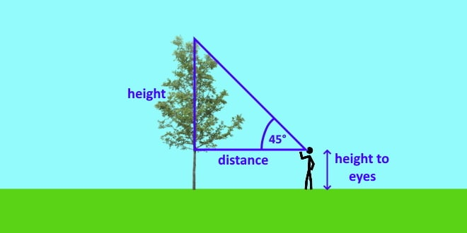

# November 4, 2021
time: 2

# Class Discussion
- Basic intro to: Functions, libraries, and classes
- How to use functions in math.h library
- How headers work
- int main() can go wherever it wants
- foo, bar variables...
- What are fiber optic cables?
---
## Resources
- [math.h reference](https://www.cplusplus.com/reference/cmath)
- [Fiber Optics Video](https://www.youtube.com/watch?v=jZOg39v73c4)
---
## Homework
1) Finding height of tree

A forest management company is tasked with documenting every tree in a county park. One of the pieces of information they must produce is the approximate height of the tree.

To figure this out, an observer would view the tree at a distance and make the following measurements:
- The angle of the very top of the tree within viewpoint
- His own height
- The distance he stood from the tree when taking the angle measurement

The formula an observer would use to determine the hight of a tree:
```
H = (Tan(A * d)) + y
``` 
- H = height of the tree
- d = distance of the observer from the tree
- A = angle to the top of the tree
- Y = the height of the observer
- "Tan" refers to "tangent"

Please write a simple program using the cMath library (math.h) to provide inputs for an observer's measurements in order to determine the height of a tree.

Be sure your program includes the following:
- Error checking for inputs
- The use of at least one function other than "int main()"
- Showing the use of a function from the math.h library (link in resources above to library reference)



---
# Reading Homework
1) **Reading work** - due by begining of next week (Sunday, November 14, 2021)
- [C++: A Beginner's Guide, Second Edition](http://192.168.1.45:8083/book/945)
  - Read all of Chapter 2


