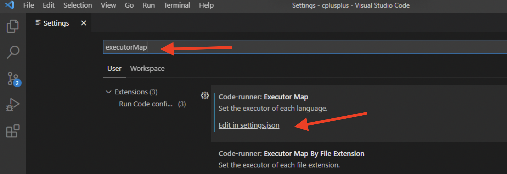
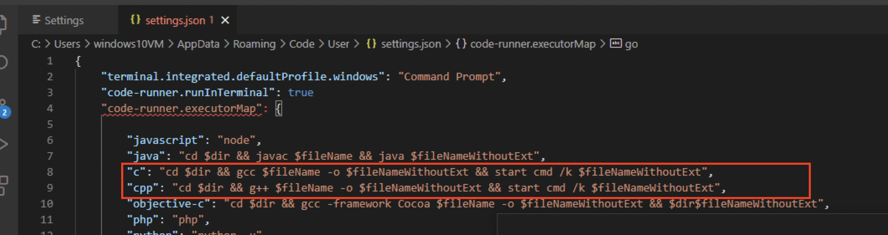
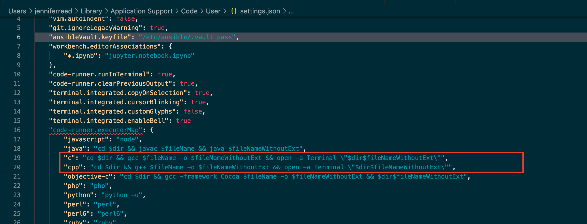

# Console programming with VS Code
1. Install [Mingw-64](https://sourceforge.net/projects/mingw/)
    - Video tutorial on [installing mingw for Windows 10](https://www.youtube.com/watch?v=9PAglZlRolo)
2. Install [VS Code](https://code.visualstudio.com/download) 
3. [Set up PATH system environment variable](https://windowsreport.com/edit-windows-path-environment-variable/): C:\MinGW\bin
4. Make sure to set your default terminal to command prompt and not PowerShell
5. [Configure VS Code for GCC with Mingw-64](https://code.visualstudio.com/docs/cpp/config-mingw#_prerequisites)
    - Install c++ intelligence plugin
    - Install "Code Runner" plugin
      - configure code runner settings to output to terminal

# Configuring codeRunner to run code in external terminal window
1. In VS Code, go to settings.
2. Search for "executorMap"
3. Then click on: "Edit in settings.json"

4. An editor for settings.json should appear
5. On a blank line, type in the following:
   ```
   "code-runner.executorMap
   ```
6. At this point, it should auto-complete a number of settings for code runner to execute for various languages.
7. You'll need to edit the settings for "C" and "C++" as follows:
    - Windows:
      
    - Mac OS:
      
    - Linux:
      - TBD